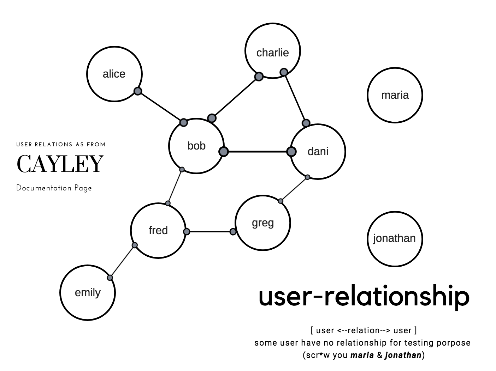

[](https://travis-ci.org/zkrhm/imd-socialnetwork)

Social Networking.

### Components 
- Gorilla Mux ([Hail Harambe](https://www.reddit.com/r/Harambe/)...!!!)
- Plain old handler
- [Cayley Graph] (https://cayley.io/) (currently running on memory graph - so there won't be persisted data out of testing data)
    - socialnetwork better to be implemented using graph structure.


### How to run.
execute following command on terminal
```bash
docker-compose up
```

### How to access : 

open [this file](docs/imd-socmed.postman_collection.json) on [Postman App](https://www.getpostman.com/)
- End POINTS:
	- http://localhost:8000/connect
	- http://localhost:8000/friend-list
	- http://localhost:8000/common-friends
	- http://localhost:8000/subscribe
	- http://localhost:8000/list-subscriber
	- http://localhost:8000/block
	- http://localhost:8000/post-update

### Using go
You need to get  installed
on Terminal execute : 
```bash
go get -u github.com/zkrhm/imd-socialnetwork
```

then do :
```bash
cd $GOPATH/src/github.com/zkrhm/imd-socialnetwork
go dep
```


### Rules
this program following these rules : 
- Registered user can connect to other registered user
    - connected user become update receiver until/unless he do block person who publishing update
- User cannot connect to other user who blocks him
- User can subscribe to other user's update
    - this subscribing user will receive update from people who he/she subscribe to even if not connected as friend
- User can block other user
- When a user doing update, following users will be the recipient of the update
    1. this user friends
    2. users who subscribe
    3. registered user who mentioned at text update
   and following user won't become the recipient
   1. friend who block him
   2. registered user who are not friend
   3. unregistered email address mentioned on his / her update.

### List of Registered user.
You can check at app/app.go

- bob@example.com
- alice@example.com
- greg@example.com
- fred@example.com
- emily@example.com
- dani@example.com
- charlie@example.com
- jonathan@example.com
- maria@example.com

### Friend Relationship



Tested on Golang ver.1.10.3, Docker image on ver.1.10.4